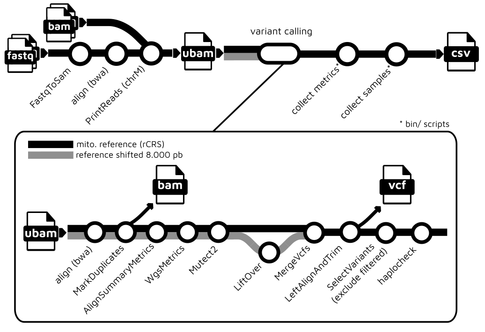

# Human Mitochondrial Workflow

This repository contains a [nextflow](https://www.nextflow.io/) workflow for running mitochondrial analysis. This workflow is heavily inspired by the [gatk-workflows/gatk4-mitochondria-pipeline](https://github.com/gatk-workflows/gatk4-mitochondria-pipeline) and by the [nf-core](https://nf-co.re) community.

## Quickstart

The workflow uses [nextflow](https://www.nextflow.io/) to manage compute and
software resources, as such nextflow will need to be installed before attempting
to run the workflow.

The workflow can currently be run using either [Docker](https://www.docker.com/products/docker-desktop) or [conda](https://docs.conda.io/en/latest/miniconda.html) to provide isolation of the required software. Both methods are automated out-of-the-box provided either docker or conda is installed.

<p align="center">
    
</p>

## Inputs

- Pairs of FASTQ file. One pair for each sample or
- Alignment file, one per sample. Accepts BAM or CRAM formats.
- Reference for human genome (GRCh38). [Files are available here](https://console.cloud.google.com/storage/browser/genomics-public-data/references/hg38/v0).
  - .fasta, .dict, .fai, .ann, .amb, .sa, .pac, .alt

> Note: if you are using alignments then you need to use the same version of the mapped reference in the parameter _--reference_. This pipeline only supports versions of GRCh38/Hg38.

## Workflow options

```bash
# For help:
nextflow run lmtani/wf-human-mito -r main --help

# Example:
nextflow run lmtani/wf-human-mito -r main \
    --fastq 'fastqs/*_R{1,2}.fq.gz' \ # ex: sample_R1.fq.gz and sample_R2.fq.gz
    --alignments 'bams/*.cra{m,i}' \  # ex: sample.cram and sample.crai
    --reference /refs/Homo_sapiens_assembly38.fasta \
    --outdir outdir \
    -profile conda   # or docker
```

## Workflow outputs

- Alignment in BAM format (outdir/alignments/)
- Variants in VCF format (outdir/variants/)
- CSV file with informations, e.g: Haplotype groups (major and minor), coverage, etc. for all samples.

## Useful links

- [nextflow](https://www.nextflow.io/)
- [docker](https://www.docker.com/products/docker-desktop)
- [conda](https://docs.conda.io/en/latest/miniconda.html)

### TODOs

- [ ] In `COLLECT_WGS_METRICS` process, the input value "readLen" should be dynamic. This info is inside COLLECT_ALIGNMENT_METRICS output.
